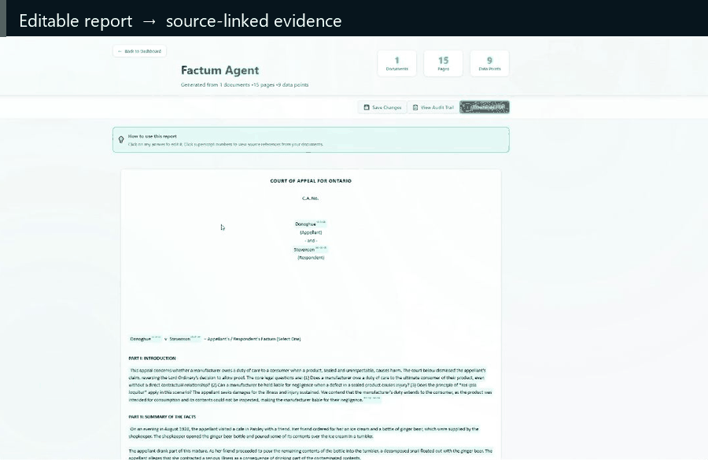

# Attenly

**Self-hosted reporting where the handoff between AI and human expertise stays
visible.**

Attenly is built for subject-matter experts who need structured, recurring
reports without becoming prompt engineers—and for technical teams that need
control over deployment, models, and data. Define a reusable workflow, turn
PDFs, DOCX files, and text documents into an editable draft, inspect each answer
against its source, correct anything the model missed, and export the result.

AI drafts; people remain responsible for the finished report. Source-linked
references and the audit trail make it clear what the model produced and what a
person changed.

The default Docker profile keeps the application, database, and uploaded files
on infrastructure you control. Document content is sent to the model provider
you configure; use Ollama or a private OpenAI-compatible endpoint to keep that
model path on your network.

[Watch the full demo](https://www.youtube.com/watch?v=TW4FYGe4cGU) ·
[Quickstart](#quickstart) ·
[Get setup help](https://github.com/roblen001/attenly/issues/new?template=setup_or_bug.yml) ·
[Share a workflow](https://github.com/roblen001/attenly/issues/new?template=workflow_request.yml)

[](https://www.youtube.com/watch?v=TW4FYGe4cGU)

*Open a reference from the generated report and inspect the supporting source
passage.*

## What Attenly is for

Attenly fits repeated document-to-report work: legal and compliance reviews,
due-diligence packs, renewal summaries, and internal operational reports. It is
designed for workflows where the output must be reusable, editable, and
reviewable—not just conversational.

Many document-AI products land in an awkward middle: too complex for the
experts doing the work, but too closed or constrained for technical teams to
operate confidently. Attenly separates those jobs. A technical owner can
self-host and configure it; a subject-matter expert can define, generate,
verify, and revise the report without hiding the boundary between AI and human
work.

| | |
| --- | --- |
| Best fit | The same report structure, rebuilt from changing source documents |
| Output | Editable web reports with PDF export |
| Review | Source-linked references and an audit trail |
| Models | Ollama/private OpenAI-compatible endpoints or Gemini |
| Deployment | Docker Compose on an x86-64 host |
| Optional | Microsoft 365 mailbox ingestion and browser OIDC |

## How it works

1. Define the questions and layout once as a reusable agent.
2. Upload documents directly or receive them through a Microsoft 365 mailbox.
3. Generate a structured report and edit it in the browser.
4. Open a reference to review the exact source, then export the result.

## Deployment profiles

The default self-hosted profile is a **single-workspace internal deployment**:

- one deployment access token unlocks one shared workspace;
- SQLite and uploaded documents persist in one Docker volume;
- report generation and embeddings use either an OpenAI-compatible endpoint or
  Gemini;
- email connectors are disabled until an administrator enables one;
- the web service and long-running email worker run separately so reports stay
  responsive while email jobs are processed.

Enterprise deployments can instead enable generic browser OIDC, with Microsoft
Entra as the first documented provider. Each employee gets a distinct Attenly user, private files
and reports, organization-shared agents, and locally revocable sessions. See
[Authentication](#authentication) and [Enterprise SSO](docs/ENTERPRISE_SSO.md).

## Requirements

- Docker Engine or Docker Desktop with Compose v2
- an x86-64 Docker host for the published `v1.1.0` images; this release does
  not publish or test native ARM64 images
- Python 3.10 or newer for the setup and preflight scripts
- a model endpoint, or a Gemini API key
- at least 8 GB of free space for the published Attenly images, plus model and
  document storage; allow at least 20 GB of free space when building the large
  OCR-enabled backend image from source

## Quickstart

Choose one model setup, create `.env`, and start Compose.

```bash
git clone https://github.com/roblen001/attenly.git
cd attenly
```

The first start downloads several gigabytes of container images. The published
`v1.1.0` images currently require an x86-64 host.

### Option A: Ollama or another OpenAI-compatible endpoint

For a small local Ollama setup with chat, embeddings, and multimodal template
ingestion:

```bash
ollama pull qwen3.5:9b
ollama pull embeddinggemma
```

Create the environment file:

```bash
python scripts/init_self_hosted_env.py --provider openai_compatible --model-base-url http://host.docker.internal:11434/v1 --llm-model qwen3.5:9b --embedding-model embeddinggemma:latest --embedding-dimensions 768 --template-ingest-provider openai_compatible --template-ingest-model qwen3.5:9b
```

Use a private HTTPS URL instead of `host.docker.internal` when the model server
runs elsewhere on the company network. Omit `--template-ingest-provider` and
`--template-ingest-model` if smart template uploads are not needed.

The listed Ollama models were checked against the public Ollama library for this
release. Model availability still changes over time; the setup is not tied to
these particular models. `embeddinggemma` requires Ollama v0.11.10 or newer.

### Option B: Gemini

```bash
python scripts/init_self_hosted_env.py --provider gemini --llm-model gemini-3.5-flash --embedding-model gemini-embedding-2 --embedding-dimensions 768 --template-ingest-provider gemini --template-ingest-model gemini-3.5-flash
```

The script securely prompts for `GEMINI_API_KEY` if it is not passed on the
command line. Prefer the prompt so the key is not saved in shell history.

### Start Attenly

```bash
python scripts/check_self_hosted_env.py .env
docker compose up -d --wait
```

Open <http://localhost:5173>. Enter the `LOCAL_AUTH_TOKEN` from `.env` on the
login page.

To print only that generated token:

Linux or macOS:

```bash
grep '^LOCAL_AUTH_TOKEN=' .env | cut -d= -f2-
```

PowerShell:

```powershell
(Get-Content .env | Where-Object { $_ -like "LOCAL_AUTH_TOKEN=*" }) -replace "LOCAL_AUTH_TOKEN=", ""
```

Treat this token like a workspace password. Do not place it in a `VITE_`
variable: all frontend configuration is readable by browser users.

## What “OpenAI-compatible” means

The models can run entirely on company hardware. Attenly only requires the
gateway to accept the usual OpenAI request/response shapes at:

- `POST <base-url>/chat/completions`
- `POST <base-url>/embeddings`

Set the base URL including `/v1`, for example:

```dotenv
OPENAI_COMPATIBLE_BASE_URL=https://models.company.internal/v1
OPENAI_COMPATIBLE_API_KEY=replace-with-gateway-token
LLM_MODEL=company-chat-model
EMBEDDING_MODEL=company-embedding-model
EMBEDDING_DIMENSIONS=768
```

Ollama, vLLM, LM Studio, or a company-built adapter can provide these routes.
See [Model gateways](docs/MODEL_GATEWAYS.md) for the exact contract, Ollama
server setup, network guidance, and verification commands.

## Microsoft 365 email (optional)

Start with the upload/report flow first. To add Microsoft Graph without
changing the existing model settings:

```bash
python scripts/configure_microsoft_graph_env.py .env --graph-tenant-id replace-with-tenant-id --graph-client-id replace-with-client-id --graph-mailbox attenly@company.com
```

The script prompts securely for the client secret. Then validate the Entra app,
Graph permissions, and mailbox:

```bash
python scripts/check_microsoft_graph_connection.py .env
docker compose up -d --force-recreate --wait
```

For a real outbound test:

```bash
python scripts/check_microsoft_graph_connection.py .env --send-test-to you@company.com
```

The Entra application needs application permissions `Mail.Read` and
`Mail.Send`, with administrator consent. Use a dedicated licensed mailbox.
Verified senders email documents directly to `GRAPH_MAILBOX`; generated
`u_...` addresses are internal routing identifiers and do not need Microsoft
365 aliases in the single-workspace profile.

See [Connectors](docs/CONNECTORS.md) for the complete Entra setup and the sender
verification/report workflow.

## Operations

Check status and logs:

```bash
docker compose ps
docker compose logs -f backend
docker compose logs -f email-worker
```

Stop without deleting data:

```bash
docker compose down
```

Delete the deployment data volume only when data loss is intended:

```bash
docker compose down -v
```

Changing `.env` requires container recreation:

```bash
docker compose up -d --force-recreate --wait
```

Source code changes require a rebuild:

```bash
docker compose -f compose.yml -f compose.build.yml up -d --build --wait
```

The default stack publishes only the frontend port. Nginx proxies `/api` to the
private backend service. `backend` and `email-worker` share the `attenly-data`
volume, which contains `/data/attenly.db` and `/data/storage`.

Back up the volume before upgrades. A simple Docker-volume backup procedure is
documented in [Self-hosting](docs/SELF_HOSTING.md).

To change the browser port, regenerate the environment file with, for example,
`--frontend-port 5174`, or set `ATTENLY_FRONTEND_PORT=5174` in `.env`.

## Authentication

| Mode | Intended use | Current behavior |
| --- | --- | --- |
| `local` | Trusted internal pilot | One shared bearer token and workspace identity |
| `oidc` | Enterprise browser SSO | Generic Authorization Code + PKCE BFF; Microsoft Entra is the first documented target; distinct users, private files/reports, and organization-shared agents |
| `external_jwt` | Company gateway or IdP integration | Validates an HMAC secret or issuer/audience/JWKS; the user pastes/provides the token |
| `supabase` | Existing hosted or multi-user deployment | Supabase browser authentication and provider-backed persistence |

For a local Microsoft Entra test, the guided command below preserves the
existing model/storage configuration, securely prompts for the three Entra
values, and validates the result:

```powershell
python scripts/configure_oidc_env.py .env.docker-test
```

Use the Directory (tenant) ID, Application (client) ID, and client secret Value.
Do not use the app Object ID or the client Secret ID. Continue with the exact
build/start command in [Enterprise SSO](docs/ENTERPRISE_SSO.md).

The default local profile is not user-account management. Every person using
the same token shares one identity. For enterprise users, use `oidc`: files,
saved reports, usage, and email settings remain scoped to the signed-in user;
custom agents are visible to active members of the deployment organization.
Agent creators and organization admins can edit/delete them. Put every
production deployment behind HTTPS, firewall rules,
and the organization’s normal access controls.

## Configuration and customization

Provider selection is environment-driven. Companies can switch model,
embedding, storage, authentication, and email providers without editing the
report-generation code. The current support matrix and extension boundaries are
documented in [Provider matrix](docs/PROVIDER_MATRIX.md).

Important example files:

- `.env.example` — recommended single-workspace Docker profile
- `.env.enterprise.example` — Microsoft Entra/generic OIDC and company endpoint example
- `.env.default.example` — original Supabase-hosted profile
- `.env.local.example` — expanded local profile reference

Never commit `.env`. It is ignored by Git and excluded from Docker build
contexts.

## Development and validation

Run the backend through Docker to match the release environment:

```bash
docker compose -f compose.yml -f compose.build.yml up -d --build --wait
```

Frontend checks:

```bash
cd frontend
npm ci
npm run lint
npm run build
```

Frontend source development requires Node.js 22.22 or newer. Docker users do
not need Node.js installed on the host.

Profile and packaging checks:

```bash
python scripts/verify_open_source_profiles.py
python scripts/check_self_hosted_env.py .env.example
python scripts/smoke_self_hosted_compose.py
```

See [Contributing](CONTRIBUTING.md) for the branch policy and validation
expectations.

## Documentation

- [Self-hosting guide](docs/SELF_HOSTING.md)
- [Enterprise SSO](docs/ENTERPRISE_SSO.md)
- [Model gateways](docs/MODEL_GATEWAYS.md)
- [Microsoft Graph and other connectors](docs/CONNECTORS.md)
- [Provider matrix](docs/PROVIDER_MATRIX.md)
- [Docker architecture](docs/DOCKER_ARCHITECTURE.md)
- [Troubleshooting](docs/TROUBLESHOOTING.md)
- [Security policy](SECURITY.md)

## Community and support

Attenly is looking for its first real-world workflows. A failed install or a
workflow that does not fit is useful feedback—not a nuisance.

- [Get help with setup or report generation](https://github.com/roblen001/attenly/issues/new?template=setup_or_bug.yml)
- [Describe a recurring report you want to automate](https://github.com/roblen001/attenly/issues/new?template=workflow_request.yml)
- [Contribute a focused fix](CONTRIBUTING.md)

If Attenly solves a real problem for you, a GitHub star helps other self-hosters
find it. Please do not include confidential documents, credentials, or private
logs in an issue.

## Security

- Use HTTPS and restrict the frontend to trusted networks/users.
- Use a long random `LOCAL_AUTH_TOKEN` and rotate it if exposed.
- Keep model and connector credentials server-side in `.env` or an external
  secret manager.
- Review uploaded documents and model-provider data policies before processing
  sensitive information.
- Uploaded files are validated, but this release does not include an antivirus
  engine. Integrate malware scanning at the gateway or storage boundary when
  required by company policy.

Report vulnerabilities privately as described in [SECURITY.md](SECURITY.md).

## License

Attenly is licensed under the [GNU Affero General Public License v3.0 only](LICENSE).
If you modify Attenly and let users interact with that modified version over a
network, the AGPL requires you to offer those users the corresponding source
code under the same license.
